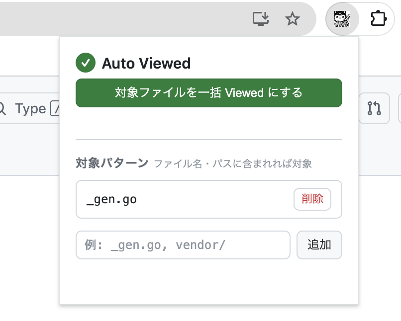

# Github PR Auto Viewed

GitHub の Pull Request「Files changed」タブで、指定したパターンに一致するファイルを一括で「Viewed」にする Chrome 拡張です。



## 機能

- **ポップアップから一括実行** — 拡張アイコンをクリックして「対象ファイルを一括 Viewed にする」ボタンを押すだけ
- **柔軟なパターン設定** — ファイル名・パスに文字列が含まれれば対象（部分一致）
- **パターンの永続化** — `chrome.storage.sync` で保存、複数デバイス間で同期
- **既に Viewed のファイルはスキップ**

### デフォルトパターン

| パターン | 対象例 |
|---|---|
| `_gen.go` | `user_gen.go`, `api_gen.go` |
| `.pb.go` | `service.pb.go` |
| `_mock.go` | `client_mock.go` |

ポップアップからパターンの追加・削除が可能です。`vendor/` のようにディレクトリ指定もできます。

## インストール

Chrome Web Store には未公開のため、手動でロードします。

1. このリポジトリをクローン
   ```bash
   git clone https://github.com/Syy9/github-pr-auto-viewed.git
   ```

2. Chrome で `chrome://extensions` を開く

3. 右上の **「デベロッパーモード」** をオンにする

4. **「パッケージ化されていない拡張機能を読み込む」** をクリックし、クローンしたディレクトリを選択

## 使い方

1. GitHub の PR ページを開く
2. **「Files changed」** タブをクリック
3. Chrome ツールバーの拡張アイコンをクリック
4. **「対象ファイルを一括 Viewed にする」** ボタンをクリック
5. パターンに一致するファイルが順次 Viewed になる

「Files changed」以外のタブを開いている場合、ポップアップには案内メッセージが表示されます。

### パターンの追加・削除

拡張アイコン → ポップアップ下部のフォームからパターンを追加・削除できます。

## 注意事項

- **40件超の PR**: GitHub はファイルを遅延読み込みするため、現在画面に表示されているファイルのみ対象になります
- **クリック間隔**: GitHub への負荷を避けるため 300ms 間隔で順次処理します

## ディレクトリ構成

```
.
├── manifest.json     # Manifest V3
├── content.js        # Viewed ボタンの操作ロジック
├── popup.html        # ポップアップ UI
├── popup.js          # ポップアップのロジック
├── popup.css         # ポップアップのスタイル
├── generate-icons.js # アイコン生成スクリプト（開発用）
└── icons/
    ├── icon16.png
    ├── icon48.png
    └── icon128.png
```

## 開発

### 拡張機能の更新反映

`chrome://extensions` で対象拡張の更新ボタン（↺）を押した後、GitHub ページをリロードしてください。

## License

MIT
